Static Website Hosting on AWS using S3, CloudFront & Route 53

## Project Overview
Hosting a highly available static website on AWS using Amazon S3 for storage, CloudFront for global content delivery, and Route 53 for DNS management.

## Architecture Diagram
User → Route 53 → CloudFront → S3 Bucket
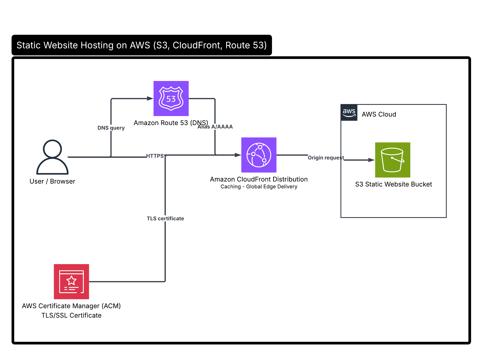

## AWS Services Used

- Amazon S3 – Stores website files. It was chosen because the website is static and does not require a backend server. It provides a cost-effective, scalable, and low-maintenance hosting solution.
- Amazon CloudFront – Speeds up content delivery globally through edge caching.
- Amazon Route 53 – DNS routing and custom domain management.
- AWS Certificate Manager (ACM) – HTTPS certificate.

## Workflow
1. User enters the domain name in the browser.
2. Route 53 resolves the domain request.
3. CloudFront receives the request and serves cached content.
4. CloudFront retrieves website files from the S3 bucket.
5. The static website is delivered securely to the user.

## Deployment Steps

 Step 1 — Create S3 Bucket
- Created an Amazon S3 bucket
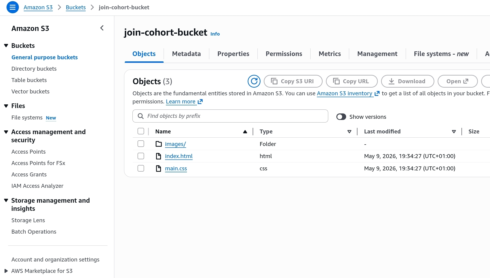
- Uploaded HTML file
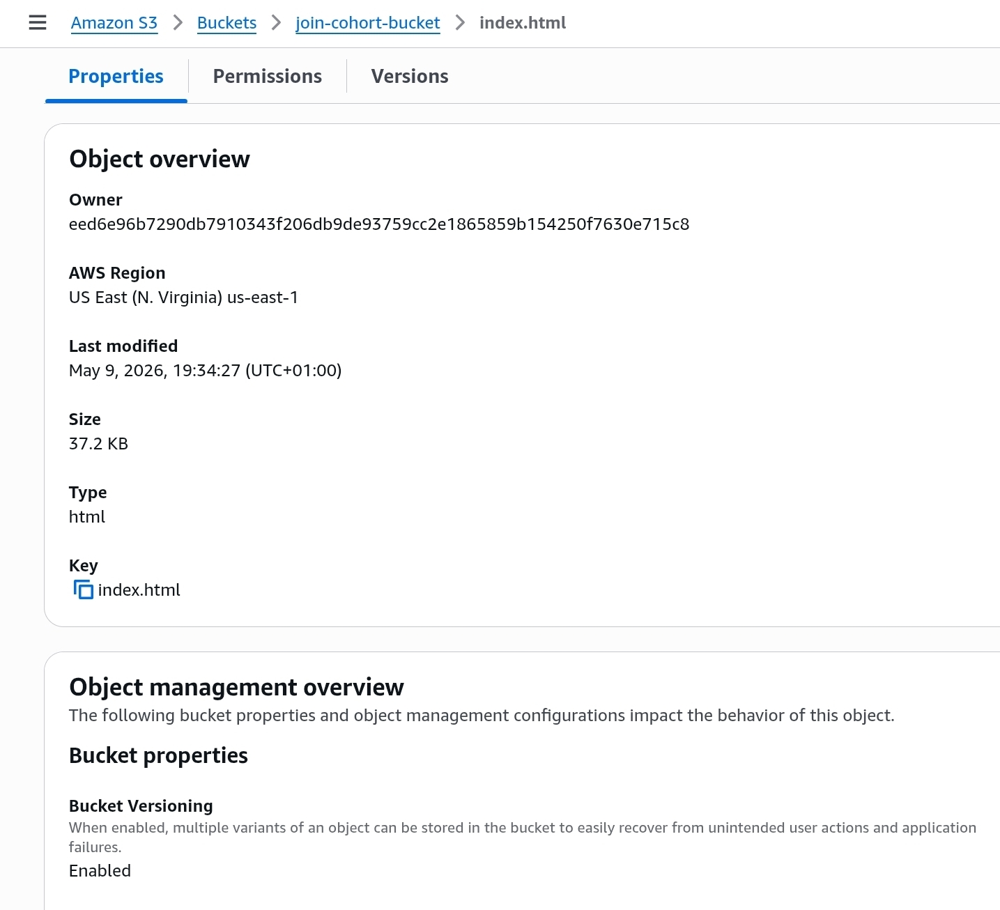
- Uploaded CSS file
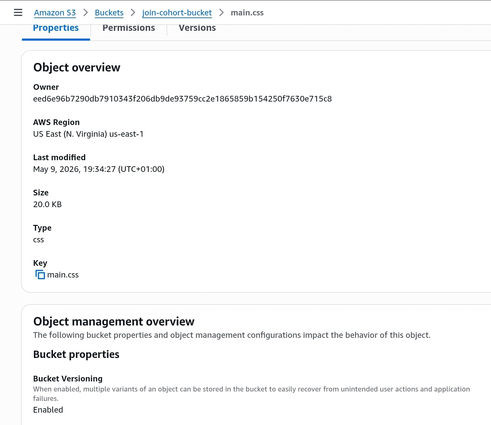
- Uploaded images folder content
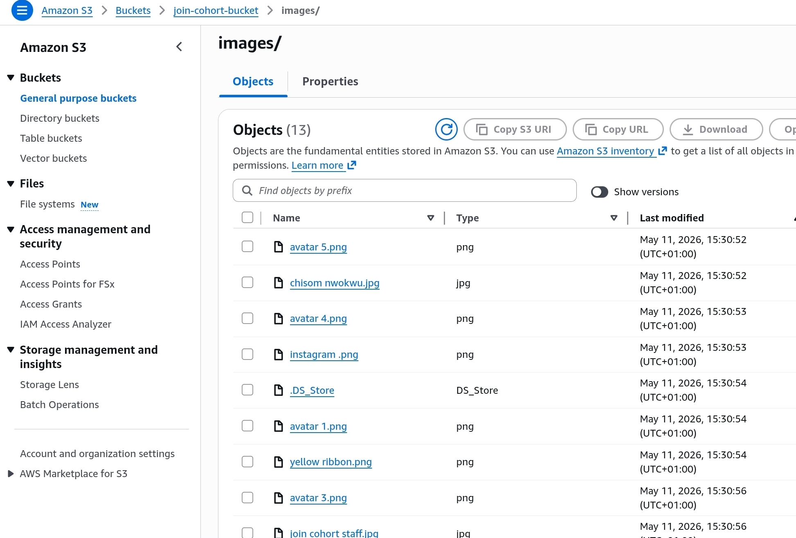
- Enabled static website hosting
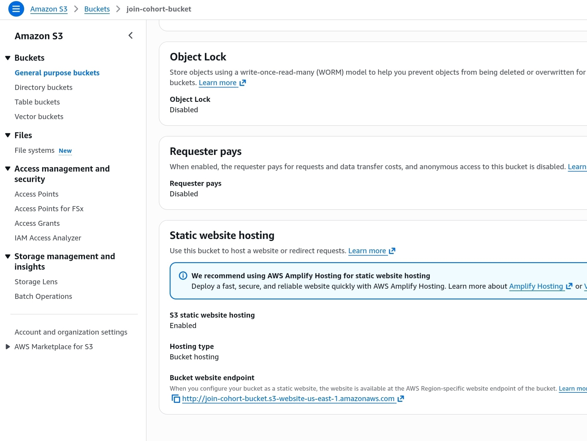

Step 2 — Configure Bucket Policy
- Allowed public read access
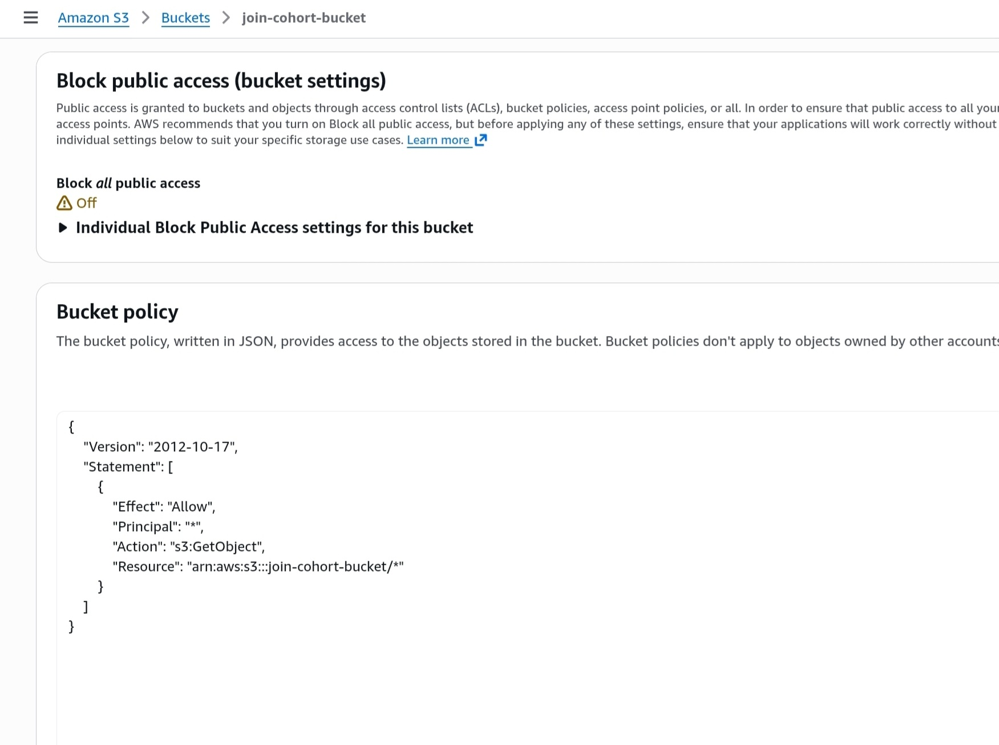

Step 3 — Create CloudFront Distribution
- Connected S3 bucket as CloudFront origin
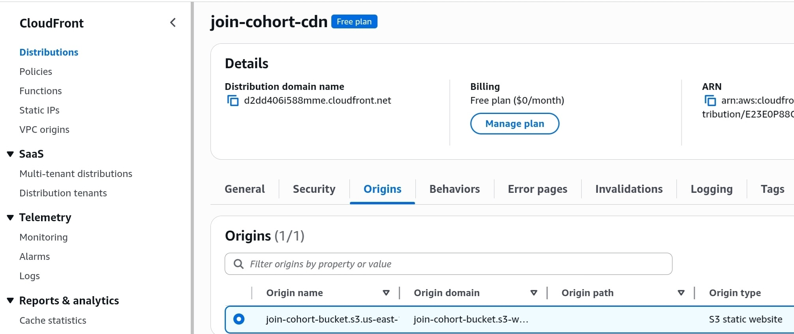
- Configured custom domain
- Enabled HTTPS delivery using SSL certificate
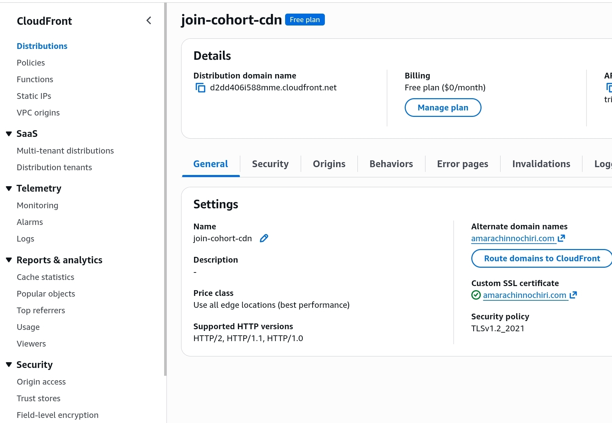

Step 4 — Configure Route 53
- Created Route 53 hosted zone
- Configured DNS A record
- Routed custom domain to CloudFront distribution
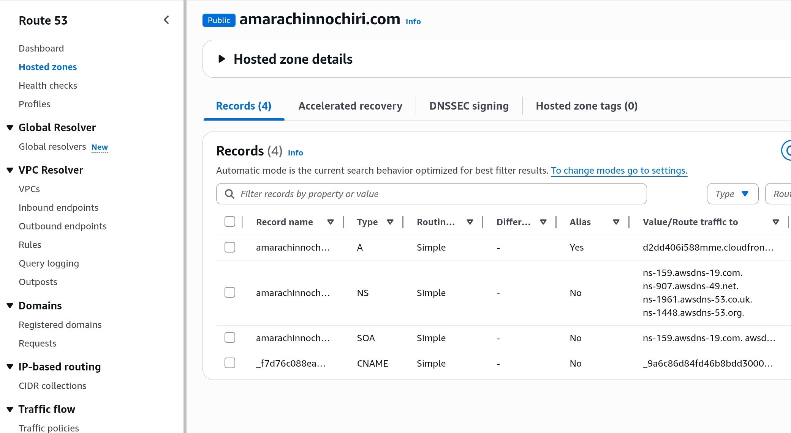
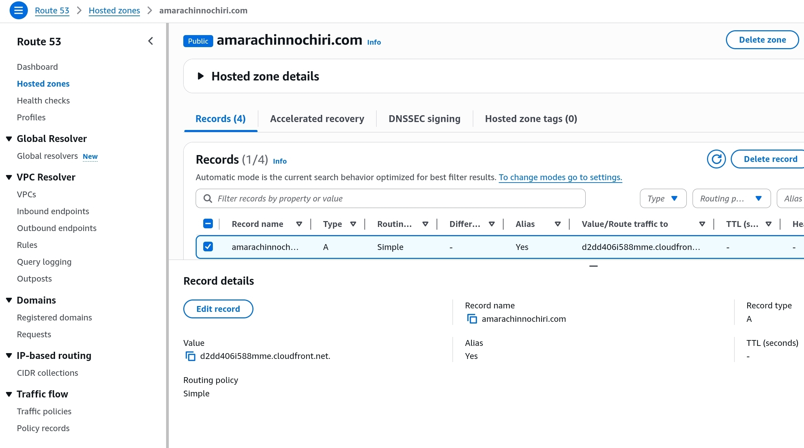

 Step 5 — Test Website Access
- Verified website accessibility
- Confirmed successful deployment through Route53 CloudFront

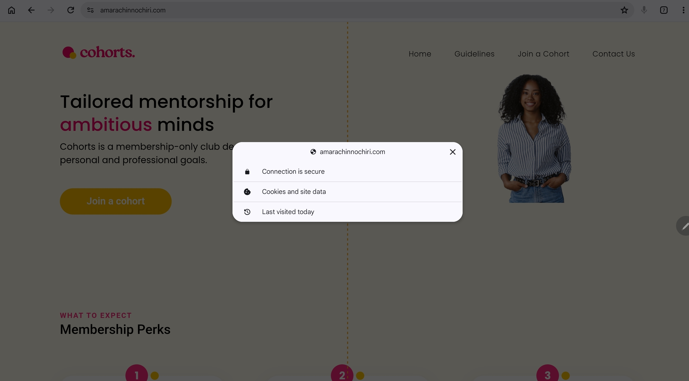

## Security Considerations
- Configured bucket policies to allow public read access only where required.
- Used CloudFront to improve content delivery performance.
- Implemented HTTPS support using AWS Certificate Manager.

Note: Public read access was enabled specifically for static website hosting purposes within this demonstration project. In production environments, S3 public access should be minimised and secured using best practices such as Origin Access Control (OAC), least privilege policies, and restricted bucket access.

## Cost Considerations
- S3 chosen because it is cost-effective for static content
- CloudFront reduces repeated origin requests through caching
- Serverless/static hosting avoids EC2 costs

## Challenges Faced
- DNS propagation delays when connecting Route 53 to CloudFront.
- CloudFront deployment waiting times.
- S3 bucket permission configuration.
- Understanding bucket policy structure and public access settings.

## Skills Demonstrated
- AWS Cloud Architecture
- Static Website Hosting
- DNS Configuration
- CDN Configuration
- S3 Bucket Management
- CloudFront Distribution Setup
- IAM and Bucket Policies
- Troubleshooting and Deployment

## Future Improvements
- Automate deployment using Terraform
- Add CI/CD pipeline with GitHub Actions
- Configure Origin Access Control (OAC)
- Implement monitoring with CloudWatch

Project completed by:
Amarachi Nnochiri

